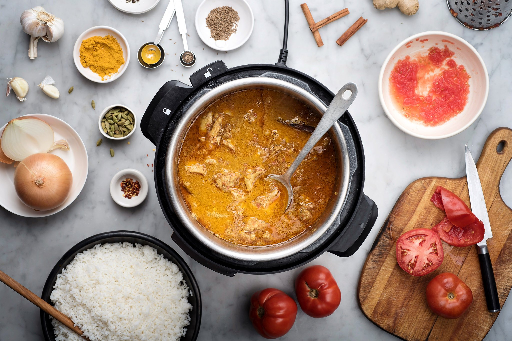

# ADS Project 5: 

Term: Spring 2018

+ Team # 7
+ Projec title:
+ Team members
	+ Anshuma Chandak (ac4258)
	+ Hanying Ji (hj2473)
	+ Lan Wen (lw2773)
	+ Qianhui Wan (qw2243)
	+ Xueying Ding (xd2196)

 
+ Project summary: Food is an innate part of any culture or region. Every cuisine has some unique ingredients or some ingredients that are used in almost all of its dishes. If you visit Korea, the markets would be sprawled with kimchi and the smell of squids. The colourful and aromatic spice markets of India indicate the natural use of diverse spices in the Indian cooking. In this project, we predict the category of a dish's cuisine given a list of its ingredients. We are using Yummly's data which is arranged by  Cuisine, dish ID, and its ingredients.We started off with 6849 ingredients, and used the bag-of-words model to reduce the number of ingredients to 2000.  We have divided this project into two parts. The first part is to use different algorithms (**Random Forests, XGBoost,SVM, Logistic Regression, Decision Tree,KNN**) to predict the category of a dish, and aim at improving the accuracy. The second part is building an R Shiny app for exploratory data analysis, as well as recommend the cuisine and other related cuisines given a set of a ingredients. 
We aim to combine and use the knowledge from other projects in this course, and build a product that has high functionality and usability. 
	
**Contribution statement**: ([default](doc/a_note_on_contributions.md)) All team members contributed equally in all stages of this project. All team members approve our work presented in this GitHub repository including this contributions statement. 

Following [suggestions](http://nicercode.github.io/blog/2013-04-05-projects/) by [RICH FITZJOHN](http://nicercode.github.io/about/#Team) (@richfitz). This folder is orgarnized as follows.

```
proj/
├── lib/
├── data/
├── doc/
├── figs/
└── output/
```

Please see each subfolder for a README file.

Contribution statements:
+ Anshuma Chandak :
+ Hanying Ji :
+ Lan Wen :
+ Qianhui Wan :
+ Xueying Ding :

References:
+ [Kaggle Competition: What's cooking](https://www.kaggle.com/c/whats-cooking)
