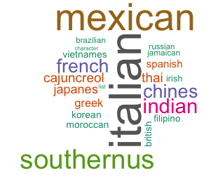

# ADS Project 5 : What shall we cook tonight ?

Term: Spring 2018

+ Team # 7
+ **Project Title** : What shall we cook tonight? 
  
  [→ Our App Click Here!](https://hanying-ji.shinyapps.io/Proj5/)
  
+ **Team members**
	+ Anshuma Chandak (ac4258)
	+ Hanying Ji (hj2473)
	+ Lan Wen (lw2773)
	+ Qianhui Wan (qw2243)
	+ Xueying Ding (xd2196)

 
+ **Project summary**: Food is an innate part of any culture or region. Every cuisine has some unique ingredients or some ingredients that are used in almost all of its dishes. If you visit Korea, the markets would be sprawled with kimchi and the smell of squids. The colourful and aromatic spice markets of India indicate the natural use of diverse spices in the Indian cooking. In this project, we predict the category of a dish's cuisine given a list of its ingredients. We are using Yummly's data which is arranged by cuisine, dish ID, and its ingredients. Aiming to combine and use the knowledge from other projects in this course, and build a product that has high functionality and usability, we have divided this project into two parts:

**The first part is Algorithm Comparison.** We started off with 6849 ingredients, and used the **bag-of-words model** to reduce the number of ingredients to 2000. Then use different algorithms (**Random Forests, XGBoost, SVM, Logistic Regression, Decision Tree, KNN**) to predict the category of a dish, and aim at improving the accuracy the prediction. Following is our algorithms summary, from which we can see that **Logistic Regression** outperforms others under this situation:
	

	
**The second part is to build an R Shiny app** for exploratory data analysis, as well as recommend the cuisine and other related cuisines given a set of a ingredients.

The following word clouds show the different cuisines, and the assortment of ingredients in our data set (the size reflects the number of recipes): 

  

We wish to apply a superior model to predict a specific cuisine given various different ingredients we put in. Image when it’s dinner time, you open the refrigerator and see there are kimchi, romaine lettuce inside. You wonder what to cook for tonight. So the shiny app could provide you a useful cooking recommendations given the ingredients you have. From the six algorithms we used in previous part, logistic regression model performs the best. For example, if you have kimchi and romaine lettuces as your inputs, you will get a predicted “Korean” cuisine result. 

We also introduced Pearson Correlation algorithm to calculate the similarities between all 20 different cuisines in our dataset. So if you get a most relevant recommendation given the ingredients you have, the app could also provide other two most similar cuisines for your consideration.


**Contribution statement**: ([default](doc/a_note_on_contributions.md)) All team members contributed equally in all stages of this project. All team members approve our work presented in this GitHub repository including this contributions statement. 

+ Anshuma Chandak : Explored different topics, and suggested the current topic. Kept track of the project and set the timelines. Updated the Readme file (Write up & Wordclouds). Train & test XG Boost & Decision Tree models.  
+ Hanying Ji : Mainly taking responsibility of building the R Shiny app for exploratory data analysis, which includes UI, serve and css style.
+ Qianhui Wan : Help design and built the framework of shiny app. integrate all parts in to Shiny app and the publish. 
+ Lan Wen : Bag-of-words model, train/test data split, train and test Random Forest model, data cleaning and transformation for R Shiny logistic regression model and retrain logistic regression model in R (for Shiny part).
+ Xueying Ding : Applied SVM, KNN, Logistic model to classify.


References:
+ [Kaggle Competition: What's cooking](https://www.kaggle.com/c/whats-cooking)
+ [XG Boost Reference](https://rpubs.com/mharris/multiclass_xgboost)
+ [Bag-of-words and Random Forest Reference](https://www.kaggle.com/normallydistrbuted/simple-bag-of-words-with-rf)
+ [Adding Style to Shiny App](http://bambooanalytics.co/blogs/howTo/shinystyle.html)

Following [suggestions](http://nicercode.github.io/blog/2013-04-05-projects/) by [RICH FITZJOHN](http://nicercode.github.io/about/#Team) (@richfitz). This folder is orgarnized as follows.

```
proj/
├── lib/
├── data/
├── doc/
├── figs/
└── output/
```

Please see each subfolder for a README file.


